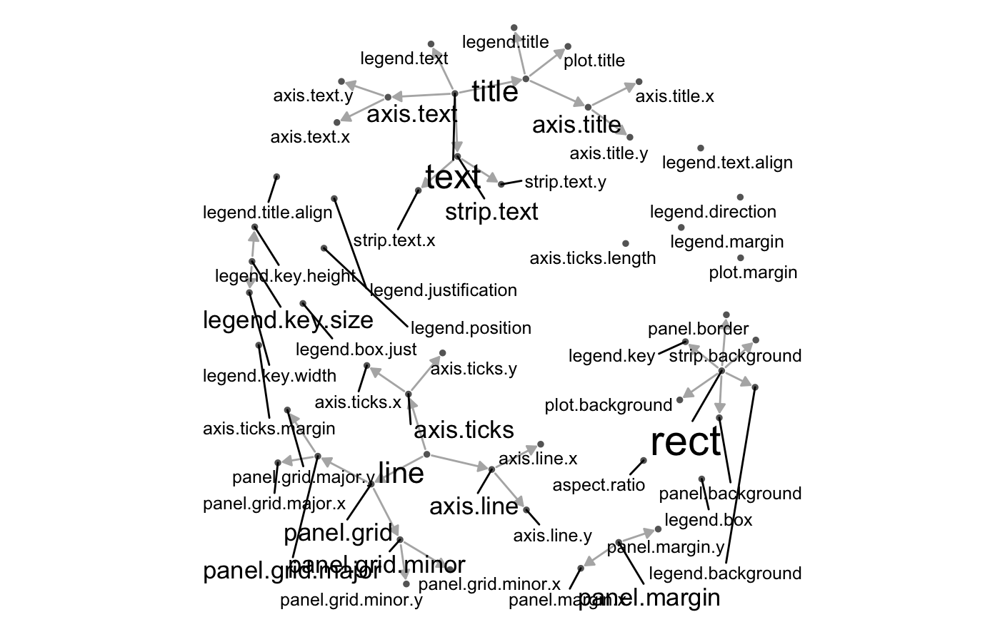
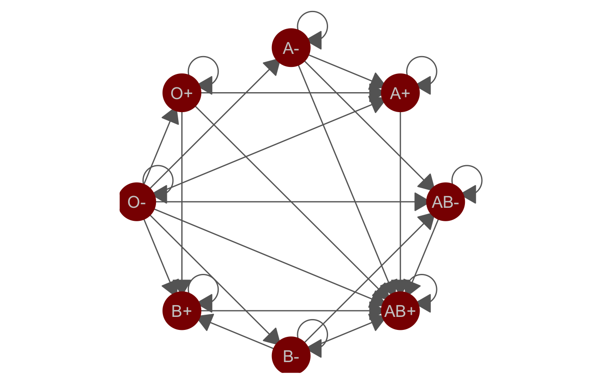
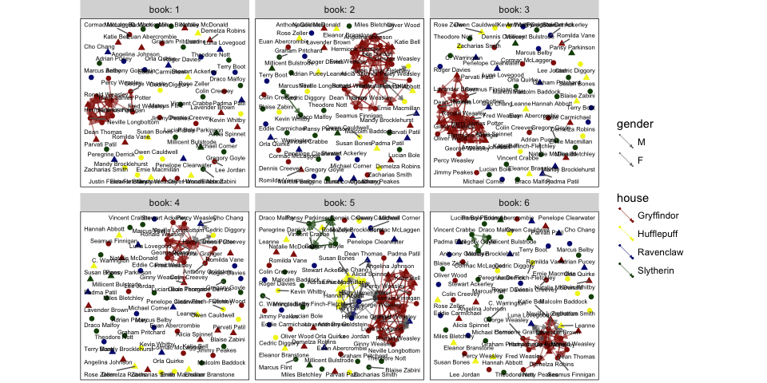

The `geomnet` package
================
Sam Tyner, Heike Hofmann
2017-04-05

<!-- README.md is generated from README.Rmd. Please edit that file -->
[](https://cran.r-project.org/package=geomnet) [](http://www.r-pkg.org/pkg/geomnet) [](https://travis-ci.org/sctyner/geomnet)

`geomnet` is a package built on top of the most recent major `ggplot2` release. It provides a `ggplot2` `geom` called `geom_net` to visualize graphs and networks. It also include the function `stat_net` to calculate network layouts with the `sna` package. Finally, the function `geom_circle` is included to draw circles using `ggplot2`.

You can install `geomnet` directly from CRAN `install.packages('geomnet')` or from Github `devtools::install_github("sctyner/geomnet")`

Examples
========

`ggplot2` Theme Elements
------------------------

This example shows the theme inheritance properties of the theme elements of `ggplot2`. Note: this example has not been updated since the release of `ggplot2 2.2.0` and as such the content may have changed.

``` r
library(dplyr)
library(geomnet)
data(theme_elements)
# data step
TEnet <- fortify(as.edgedf(theme_elements$edges[,c("parent", "child")]), theme_elements$vertices)
# create a degree variable for use later
TEnet <- TEnet %>%
  group_by(from_id) %>%
  mutate(degree = sqrt(10 * n() + 1))
# plot
ggplot(data = TEnet,
       aes(from_id = from_id, to_id = to_id)) +
  geom_net(layout.alg = "fruchtermanreingold",
    aes(fontsize = degree), directed = TRUE,
    labelon = TRUE, size = 1, labelcolour = 'black',
    ecolour = "grey70", arrowsize = 0.5,
    linewidth = 0.5, repel = TRUE) +
  theme_net() +
  xlim(c(-0.05, 1.05))
```



Blood Donation Diagram
----------------------

In this example, we reimagine the [traditional blood donation diagram](http://www.redcrossblood.org/learn-about-blood/blood-types) as a directed network. Arrows point to the blood type that receives. This example provides two data frames to `geom_net()`.

``` r
library(geomnet)
data(blood)
ggplot(data = blood$edges, aes(from_id = from, to_id = to)) +
  geom_net(colour = "darkred", layout.alg = "circle", labelon = TRUE, 
           size = 15, directed = TRUE, vjust = 0.5, labelcolour = "grey80",
           arrowsize = 1.5, linewidth = 0.5, arrowgap = 0.05,
           selfloops = TRUE, ecolour = "grey40") + 
  theme_net() 
```



Harry Potter Peer Support Network
---------------------------------

In this fun example from [this website](http://www.stats.ox.ac.uk/~snijders/siena/siena.html), there is a tie between two students if one provides emotional support to the other at some point in the book. It is a directed network, so in the visualization, the arrow points to the student receiving support.

``` r
library(geomnet)
head(hp.edges)
#>          name1              name2 book
#> 1  Dean Thomas Harry James Potter    1
#> 2  Dean Thomas   Hermione Granger    1
#> 3  Dean Thomas Neville Longbottom    1
#> 4  Dean Thomas     Ronald Weasley    1
#> 5  Dean Thomas    Seamus Finnigan    1
#> 6 Fred Weasley     George Weasley    1
head(hp.chars)
#>                name schoolyear gender      house
#> 1      Adrian Pucey       1989      M  Slytherin
#> 2    Alicia Spinnet       1989      F Gryffindor
#> 3  Angelina Johnson       1989      F Gryffindor
#> 4 Anthony Goldstein       1991      M  Ravenclaw
#> 5     Blaise Zabini       1991      M  Slytherin
#> 6     C. Warrington       1989      M  Slytherin
hp.all <- fortify(as.edgedf(hp.edges), hp.chars, group = "book")
#> Using name1 as the from node column and name2 as the to node column.
#> If this is not correct, rewrite dat so that the first 2 columns are from and to node, respectively.
#> Joining edge and node information by from_id and name respectively.
# only plot the characters with any connections in a given book. 
ggplot(data=hp.all, aes(from_id = from, to_id = to_id)) + 
  geom_net(fiteach=T, directed = T, size = 3, linewidth = .5, 
           ealpha = .5, labelon = T, fontsize = 3, repel = T, 
           labelcolour = "black", arrowsize = .5, singletons = FALSE,
           aes(colour = house, group = house, shape = gender)) + 
  scale_colour_manual(values = c("#941B08","#F1F31C", 
                                 "#071A80", "#154C07")) + 
  facet_wrap(~book, labeller = "label_both") + 
  theme_net() + theme(panel.background = element_rect(colour = 'black'))
```



Interactivity with `plotly`!
----------------------------

Now including interactivity with `ggplotly()`!

``` r
library(geomnet)
# devtools::install_github("ropensci/plotly")
library(plotly)
data(blood)
bloodnet <- fortify(as.edgedf(blood$edges), blood$vertices)
p <- ggplot(data = bloodnet, aes(from_id = from_id, to_id = to_id))

# create data plot
p2 <- p + geom_net(aes(size=Predominance, colour=type, shape=rho, linetype=group_to),
             linewidth=0.75, labelon =TRUE, directed = TRUE, labelcolour="black") +
  facet_wrap(~Ethnicity) +
  scale_colour_brewer(palette="Set2") 
ggplotly(p2)
```
